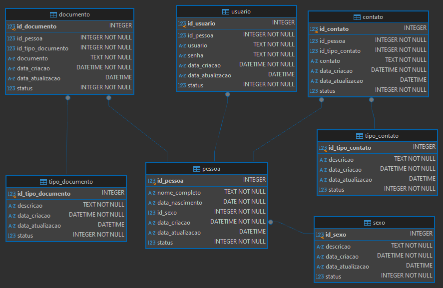

# Sistema de Gerenciamento de Pessoas 👥

## Descrição 📜
Este projeto é um sistema de gerenciamento de pessoas que permite realizar operações de cadastro, atualização, visualização e exclusão de registros de usuários. O sistema é desenvolvido em Python 🐍 e utiliza um banco de dados SQLite 🗄️ para armazenar as informações. A solução é voltada para uso em terminal, proporcionando um ambiente simples.

🎥 [Vídeo de Demonstração no YouTube](https://www.youtube.com/watch?v=W0p_s-9FCGY)

## Funcionalidades Principais 🌟
- **Cadastro de Usuários**: Permite o registro de novos usuários com validações específicas.
- **Atualização de Registros**: Usuários podem atualizar suas informações conforme necessário.
- **Visualização de Registros**: Opção para visualizar os dados cadastrados.
- **Exclusão de Registros**: Permite a remoção de usuários do sistema.

## Validações Implementadas ✅
- **Validação de CPF**: O sistema verifica se o CPF informado é válido e não permite o cadastro de usuários com CPF duplicado.
- **Validação de Telefone**: O sistema garante que o telefone informado tenha entre 8 e 15 dígitos.
- **Validação de E-mail**: Utiliza a biblioteca [email_validator](https://pypi.org/project/email-validator/) 📧 para verificar se o e-mail informado é válido. Essa biblioteca fornece funcionalidades para garantir que o formato do e-mail esteja correto e que o domínio seja válido.
- **Regras de Unicidade**: O sistema valida para não criar mais de um usuário com o mesmo CPF, e garante que não existam usuários duplicados no banco de dados.

## Estrutura do Projeto 📁
A estrutura do projeto é organizada em diversos módulos, cada um com uma função específica:

- `bancodados.py`: Gerencia a conexão com o banco de dados e a criação das tabelas necessárias. 🔗
- `cadastro.py`: Contém funções para o cadastro de novas pessoas e seus dados. 📝
- `atualizacao.py`: Responsável pela atualização das informações de uma pessoa existente. ⚙️
- `exclusao.py`: Gerencia a exclusão de registros de usuários. ❌
- `ferramentas.py`: Contém funções utilitárias, como validações de CPF, email e senha. 🛠️
- `menu_principal.py`: Apresenta o menu principal do sistema e gerencia a interação com o usuário. 📋

## Estrutura do Banco de Dados 📊
O banco de dados utilizado é relacional e normalizado. As tabelas do banco são criadas via script, garantindo uma estrutura adequada e evitando redundâncias. 



## Requisitos 📋

- Python 3.13 🐍

## Instalação das Dependências ⚙️

1. Clone o repositório:

   ```bash
   git clone https://github.com/RonieSouza/Sistema-Cadastro-Usuarios-Persistencia-BancoDados.git
   cd Sistema-Cadastro-Usuarios-Persistencia-BancoDados
   ```
   
2. Configure um ambiente virtual (opcional, mas recomendado):

   ```bash
   python -m venv venv
   # No Linux use `source venv/bin/activate`
   # No Windows use `venv\Scripts\activate`
   ```

3. Instale as dependências usando o arquivo requirements.txt:

   ```bash
   pip install -r requirements.txt
   ```
   
## Execução do Sistema 🚀
Após a instalação das dependências, você pode iniciar o sistema executando o módulo principal:

```bash
python menu_principal.py
```

## Considerações Finais 📝
Este sistema é uma solução simples para o gerenciamento de informações pessoais. O projeto é um protótipo com viés de estudo, onde há melhorias a serem implementadas. As funcionalidades podem ser expandidas conforme necessário, adicionando novos campos ou implementando recursos adicionais.

## Licença 📜
Este projeto está licenciado sob a Licença MIT. Consulte o arquivo `LICENSE` para mais detalhes.
